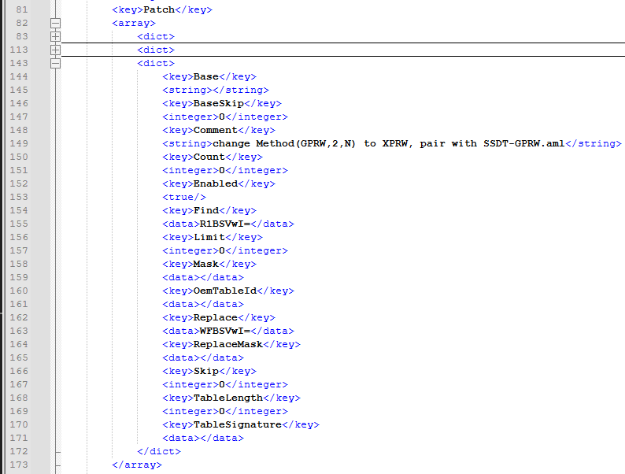
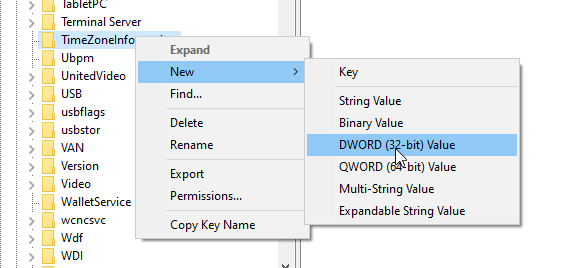
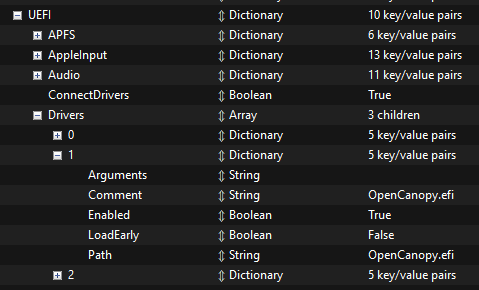

# ProBook-440-G3-Hackintosh
## EoL: Now that my laptop has died and I don't consider fixing it, the guide will not be updated after 31 Jan 2025. If the time comes, I'll even create a new guide for another laptop.

A guide about installing and fine-
tuning macOS on HP ProBook 440 G3

This specific laptop has:

Intel Core i5-6200U 2.30 GHz with HD Graphics 520 iGPU

Intel AC3615 WiFi + Bluetooth Network Card

PS/2 Keyboard and Touchpad

Conexant CX20724 Audio Card

3 USB Ports

1 2.5" SATA port

1 M.2 SATA III port (not NVMe)

## Working
WiFi

GPU

Touchpad

Keyboard

USB

Sleep (ACPI patch required)

Webcam (USB mapping required)

Sound input and output

3.5 Audio Jack

HDMI (needs patch, tested in Ventura only)

Ethernet

Fn + F1-F12 shortcuts (except F4)

iServices (FaceTime & iMessage)

Hardware audio mute and WiFi buttons

Bluetooth

## Not working

Fingerprint reader

VGA? it should work coz VGA in Skylake+ is implemented with some workarounds

Shutdown (~~WIP~~)

# Getting started
First, download latest OpenCore release [there](https://github.com/acidanthera/OpenCorePkg/releases/latest), and some kexts with SSDTs

# Kexts

## Must have

[Lilu](https://github.com/acidanthera/Lilu/releases/latest), [VirtualSMC](https://github.com/acidanthera/VirtualSMC/releases/latest), and [WEG](https://github.com/acidanthera/WhateverGreen/releases/latest)

## Other kexts
[VoodooPS2](https://github.com/acidanthera/VoodooPS2/releases/latest) for keyboard and touchpad

[AirportItlwm](https://github.com/OpenIntelWireless/itlwm/releases/latest) for WiFi. Download the one for target system. This guide will focus on Ventura

[AppleALC](https://github.com/acidanthera/AppleALC/releases/latest) for audio

[RTL8111](https://github.com/Mieze/RTL8111_driver_for_OS_X/releases/latest) for Ethernet. Skip if you don't need it

[RTCMemoryFixup](https://github.com/acidanthera/RTCMemoryFixup/releases/latest) to fix time error after reboot

SMCBatteryManager from VirtualSMC and [ECEnabler](https://github.com/1Revenger1/ECEnabler) for battery percentage

USBToolBox [tool](https://github.com/USBToolBox/tool) and [kext](https://github.com/USBToolBox/kext) to map your USB

# SSDT

For SSDT, you need [SSDT-PLUG](https://dortania.github.io/Getting-Started-With-ACPI/Universal/plug), [SSDT-EC-USBX](https://dortania.github.io/Getting-Started-With-ACPI/Universal/ec-fix), [SSDT-PNLF](https://dortania.github.io/Getting-Started-With-ACPI/Laptops/backlight) and [SSDT-GPRW](https://github.com/dortania/OpenCore-Post-Install/blob/master/extra-files/SSDT-GPRW.aml)

## Drivers

[HfsPlus.efi](https://github.com/acidanthera/OcBinaryData/blob/master/Drivers/HfsPlus.efi)

OpenRuntime.efi is already present there

# Getting started

First, map your USB on this laptop. Follow [this](https://github.com/USBToolBox/tool) for instructions

After mapping you get 2 kexts, `USBToolBox.kext` and `UTBMap.kext`, add these to other downloaded kexts.

Now download [ProperTree](https://github.com/corpnewt/ProperTree) to edit config.plist and [GenSMBios](https://github.com/corpnewt/GenSMBIOS) to generate a SMBios

`MacBookPro14,1` as SMBios is preferred for Ventura.

Create a bootable USB using one of the methods [here](https://dortania.github.io/OpenCore-Install-Guide/installer-guide/)

Put .kext files in `Kexts` folder, .aml files in `ACPI` folder and .efi files in `Drivers` folder. 

# Setting up config.plist

Copy config.plist file from OpenCore releases (Docs/Sample.plist), open it in ProperTree and perform OC Clean Snapshot (Ctrl+Shift+R)

## ACPI

### Add

ProperTree should put files automatically, so we can skip this. There should be 4 entries

### Patch

[SSDT-GPRW patch](https://github.com/dortania/OpenCore-Post-Install/blob/master/extra-files/GPRW-Patch.plist) may be required to fix sleep after some uptime (idk why that happens)

This should look like this (use NP++ or other text editor)

## Booter

Not needed, skip

## DeviceProperties

### Add

Create a new child here with name `PciRoot(0x0)/Pci(0x2,0x0)` with type `Dictionary`, and inside it add these lines

This will spoof Skylake iGPU as Kaby Lake iGPU to make it work in Ventura and fix HDMI port.

## Kernel

### Add

ProperTree should put all kexts there, but just in case move Lilu, VirtualSMC and WhateverGreen to the top so they will load first

### Quirks

Set these:

`AppleXcpmCfgLock` to True

`DisableIoMapper`to True

`LapicKernelPanic` to True

`PanicNoKextDump` to True

`PowerTimeoutKernelPanic` to True

`XhciPortLimit` to False

## Misc

### Boot

Set these:

`HideAuxiliary` to True

`PickerAttrubtes` to `17`

`PickerMode` to `Builtin`

### Debug

Set these:

`AppleDebug` to True

`ApplePanic` to True 

`Target` to `67` so it will help finding any issues during boot

`DisableWatchDog` to True

### Security

Set these:

`ScanPolicy` to `0`

`Vault` to `Optional`

## NVRAM

### 7C436110-AB2A-4BBB-A880-FE41995C9F82

Set these:

`boot-args` to `-v keepsyms=1 debug=0x100 alcid=3 rtcfx_exclude=0E-7F,AC-FF`

`prev-lang:kbd` make it blank

## PlatformInfo

### Generic

Run GenSMBios and generate data for `MacBookPro14,1`

`Type` is copied to `SystemProductName`

`Serial` is copied to `SystemSerialNumber`

`Board Serial` is copied to `MLB`

`SmUUID` is copied to `SystemUUID`

## UEFI

### Drivers

Check if `HfsPlus.efi` and `OpenRuntime.efi` are present there

### Quirks

Set these:

`ReleaseUsbOwnership` to True

`UnblockFsConnect` to True

# BIOS settings

Disable CSM and Legacy boot

# Post-Install

## Windows dual-boot

Only the case with separate drives is covered there

In BIOS disable the port with the drive where macOS is installed and enable it after installing Windows

Check if each drive has an EFI partition. If not, restore Opencore from USB on macOS drive(copy-paste) and [create EFI partition on Windows drive](https://www.tenforums.com/installation-upgrade/52837-moving-recreating-efi-partition.html#post698505)

Now you can boot both macOS and Windows from Opencore

(Windows will consider it being installed on Macbook as shown in msinfo32)

After this you need to apply one registry tweak as Windows and macOS treat time differently

Open `regedit.exe` and go to `HKEY_LOCAL_MACHINE\System\CurrentControlSet\Control\TimeZoneInformation`, right click on the folder, create a new DWORD value `RealTimeIsUniversal` there and set it to 1

## Mac-like boot picker in Opencore

Download [OcBinaryData](https://github.com/acidanthera/OcBinaryData) (Code > Download ZIP)

Extract it and delete everything in `Audio` folder (leave `OCEFIAudio_VoiceOver_Boot.mp3` if you want to set-up boot chime)

Put `OpenCanopy.efi` from Opencore release to EFI/OC/Drivers/

In `config.plist` set these:

Misc > Boot

`PickerMode` to `External`

`PickerAttributes` to `17`

`PickerVariant` to either `Auto`,`Acidanthera\Syrah`,`Acidanthera\GoldenGate` or `Acidanthera\Chardonnay`

UEFI > Drivers

Clone last driver and rename it so it will look like this

## Mac boot chime in Opencore

~~WIP~~

