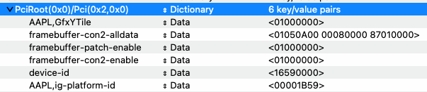

# ProBook-440-G3-Hackintosh
A repository about installing and fine-tuning macOS on HP ProBook 440 G3

This specific laptop has:

Intel Core i5-6200U 2.30 GHz with HD Graphics 520 iGPU

Intel AC3615 WiFi + Bluetooth

PS/2 Keyboard and Touchpad

3 USB Ports

## Working
WiFi

GPU

Touchpad

Keyboard

USB

Sleep (maybe)

Webcam

Sound input and output

3.5 jack

HDMI (need some patch), but there's a catch

Ethernet

Fn + F1-F12 shortcuts (except F4)

iServices (FaceTime & iMessage)

Even hardware mute and WiFi buttons

## Not working
Fingerprint reader

VGA? (no info)

Bluetooth (can be discovered and see devices but can't connect)

## Getting started
First, download latest OpenCore release [there](https://github.com/acidanthera/OpenCorePkg/releases/latest), and some kexts with SSDTs

### Kexts

## Must have

[Lilu](https://github.com/acidanthera/Lilu/releases/latest), [VirtualSMC](https://github.com/acidanthera/VirtualSMC/releases/latest), and [WEG](https://github.com/acidanthera/WhateverGreen/releases/latest)

### Other kexts
[VoodooPS2](https://github.com/acidanthera/VoodooPS2/releases/latest) for keyboard and touchpad

[itlwm](https://github.com/OpenIntelWireless/itlwm/releases/latest) for WiFi. Download the one for target system. This guide will focus on Ventura.

[AppleALC](https://github.com/acidanthera/AppleALC/releases/latest) for audio

[RTL8111](https://github.com/Mieze/RTL8111_driver_for_OS_X/releases/latest) for Ethernet. Skip if you don't need it

SMCBatteryManager from VirtualSMC and [ECEnabler](https://github.com/1Revenger1/ECEnabler) for battery percentage

USBToolBox [tool](https://github.com/USBToolBox/tool) and [kext](https://github.com/USBToolBox/kext) to map your USB

### SSDT

For SSDT, you need [SSDT-PLUG](https://dortania.github.io/Getting-Started-With-ACPI/Universal/plug), [SSDT-EC-USBX](https://dortania.github.io/Getting-Started-With-ACPI/Universal/ec-fix) and [SSDT-PNLF](https://dortania.github.io/Getting-Started-With-ACPI/Laptops/backlight)

### Drivers

[HfsPlus.efi](https://github.com/acidanthera/OcBinaryData/blob/master/Drivers/HfsPlus.efi) should suffice as other are already included

## Getting started

First, map your USB on this laptop. Follow [this](https://github.com/USBToolBox/tool) for instructions

After mapping you get 2 kexts, `USBToolBox.kext` and `UTBMap.kext`, add these to other downloaded kexts.

Now download [ProperTree](https://github.com/corpnewt/ProperTree) to edit config.plist and [GenSMBios](https://github.com/corpnewt/GenSMBIOS) to generate a SMBios

`MacBookPro14,1` as SMBios is preferred.

Create a bootable USB using one of the methods [here](https://dortania.github.io/OpenCore-Install-Guide/installer-guide/)

Put kexts in `Kexts` folder, SSDTs in `ACPI` folder and .efi files in `Drivers` folder. 

## Setting up config.plist

Copy config.plist file from OpenCore releases (Docs/Sample.plist) and open it in ProperTree

So, we need to edit te config.plist file for Mobile Intel Skylake (6th gen), simply follow [this](https://dortania.github.io/OpenCore-Install-Guide/config-laptop.plist/skylake.html)

As this is HP laptop, `Release USB Ownership` quirk may help during install. Don't forget about this

To make iGPU work in Ventura you need to spoof it as Kabylake iGPU.

Go to `Root > DeviceProperties > Add` and create a new child here with name `PciRoot(0x0)/Pci(0x2,0x0)`, type `Dictionary`, and in it add these lines

With these iGPU will work properly in Ventura and make HDMI work

